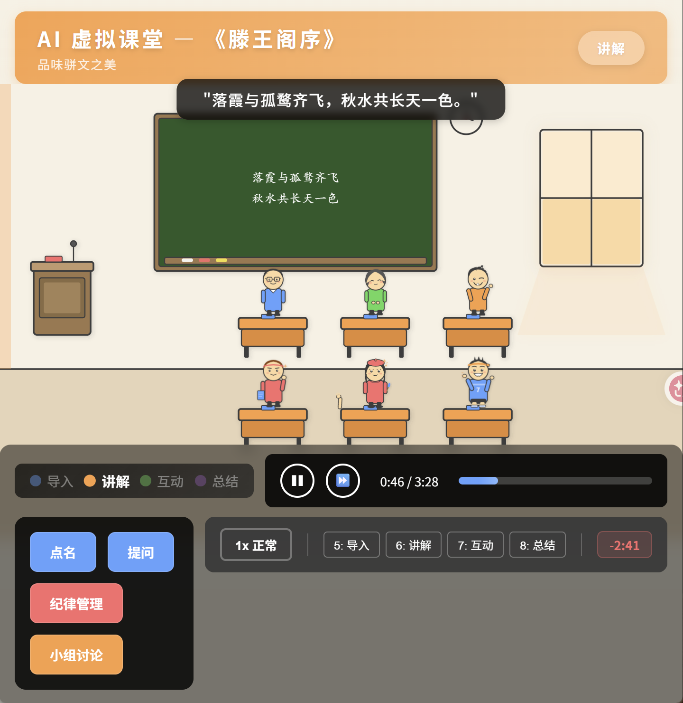
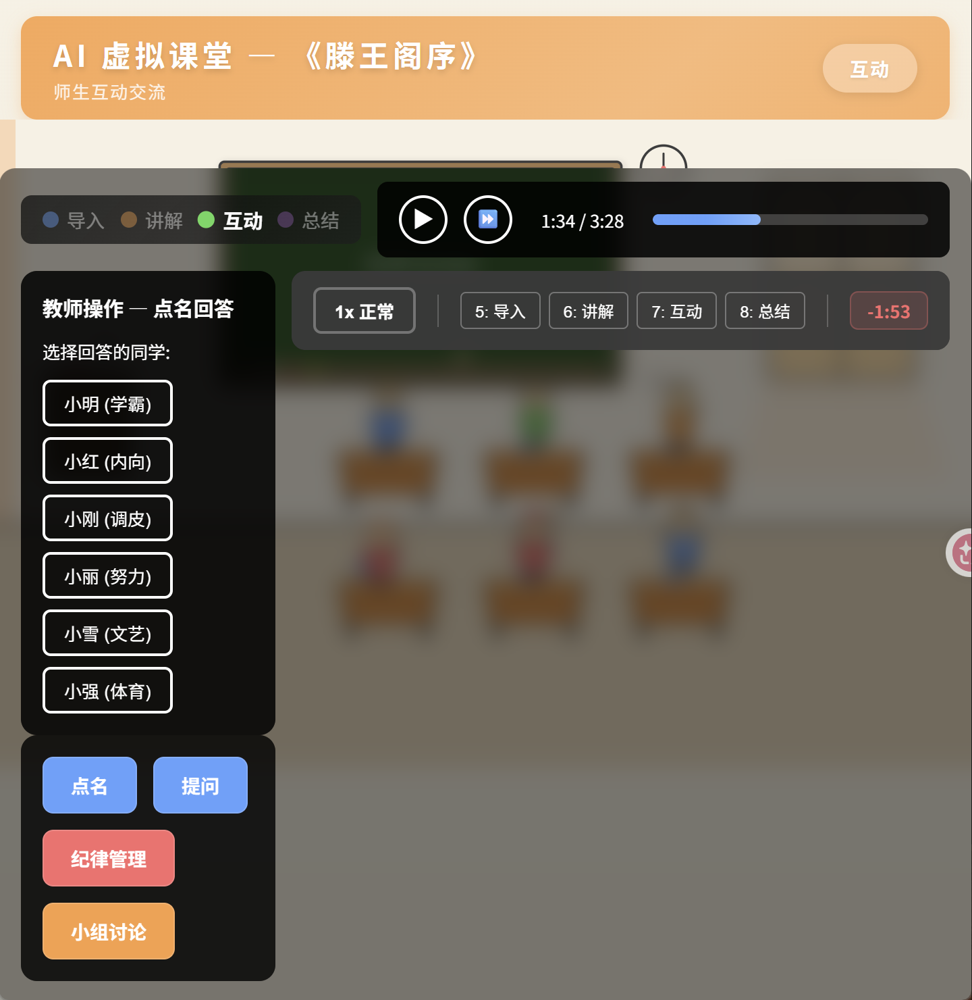

# AI 虚拟课堂 — 虚拟学生助力师范生实训

基于 React + TypeScript + SVG 的产品原型演示，展示 AI 驱动的虚拟学生在师范生教学实训中的应用场景。





## 功能特性

### 虚拟教室
- SVG 手绘卡通风格教室场景（黑板、课桌、讲台、窗户、时钟）
- 6 位性格各异的 AI 虚拟学生，各自拥有独特的外观和行为模式

### 学生类型

| 学生 | 性格 | 特点 |
|------|------|------|
| 小明 | 学霸 | 积极回答，分析深入 |
| 小红 | 内向 | 害羞但有独到见解 |
| 小刚 | 调皮 | 容易走神，需要纪律管理 |
| 小丽 | 努力 | 认真预习，踏实勤奋 |
| 小雪 | 文艺 | 感性表达，热爱文学 |
| 小强 | 体育 | 充满活力，类比思维 |

### 课堂互动
- **点名回答**：选择特定学生回答问题，触发个性化语音气泡
- **全班提问**：随机 3-4 名学生举手，教师选择回答
- **纪律管理**：针对走神/睡觉的学生进行提醒
- **小组讨论**：全班进入讨论状态，学生两两对话

### 学生状态
- 正常听讲、举手、回答问题、集体朗读、走神、睡觉
- 每种状态配有独立的 CSS 动画效果
- 教师干预即时生效，脚本状态与教师操作通过状态权威模型协调

### 课程脚本
- 完整的《滕王阁序》语文课流程（约 3.5 分钟）
- 四个教学阶段：导入 → 讲解 → 互动 → 总结
- 黑板内容随教学阶段动态变化

### 控制功能
- 播放/暂停（空格键）
- 快进到下一个互动节点（→ 键）
- 进度条拖拽跳转
- 2 倍速播放（T 键）
- 阶段跳转（5-8 键）

## 技术栈

- **框架**：React 19 + TypeScript
- **构建**：Vite
- **状态管理**：Zustand + useSyncExternalStore
- **样式**：CSS Variables + Keyframe Animations
- **图形**：SVG（内联 + 外部角色资源）
- **无后端依赖**：纯前端演示，脚本预设驱动

## 快速开始

```bash
# 安装依赖
npm install

# 启动开发服务器
npm run dev

# 构建生产版本
npm run build
```

## 项目结构

```
src/
├── App.tsx                    # 主应用组件
├── components/
│   ├── classroom/             # 教室场景（黑板、课桌、讲台）
│   ├── student/               # 学生精灵（角色、状态叠加、气泡）
│   ├── ActionBar.tsx          # 教师操作面板
│   ├── LessonTitle.tsx        # 课程标题栏
│   ├── NarratorOverlay.tsx    # 旁白/转场提示
│   ├── PhaseIndicator.tsx     # 教学阶段指示器
│   ├── RehearsalPanel.tsx     # 排练控制面板
│   ├── ScriptEngine.tsx       # 脚本引擎（加载课程脚本）
│   ├── TeacherPanel.tsx       # 教师快捷操作
│   └── TimelineControl.tsx    # 时间轴播放控制
├── data/
│   ├── lessonScript.ts        # 《滕王阁序》课程脚本
│   └── students.ts            # 学生初始数据
├── hooks/
│   ├── useKeyboardShortcuts.ts
│   ├── useScriptPlayback.ts   # 脚本回放引擎
│   └── useTeacherAction.ts    # 教师操作逻辑
├── store/
│   ├── classroomStore.ts      # Zustand 全局状态
│   └── types.ts               # TypeScript 类型定义
└── styles/
    ├── animations.css          # 状态动画定义
    └── global.css              # 全局样式 & CSS 变量
```

## 演示场景

本 demo 模拟一堂完整的中学语文课《滕王阁序》：

1. **导入**（~30s）：介绍王勃与滕王阁，小雪主动发言
2. **讲解**（~60s）：分析"落霞与孤鹜齐飞"名句，小明举手回答，小刚走神
3. **互动**（~90s）：教师点名、提问、纪律管理、小组讨论、全班齐读
4. **总结**（~30s）：回顾课程要点，学生表达感悟

## 适用场景

- 师范生教学实训产品演示
- 教育科技创业融资路演
- AI + 教育方向的概念验证

## License

MIT
