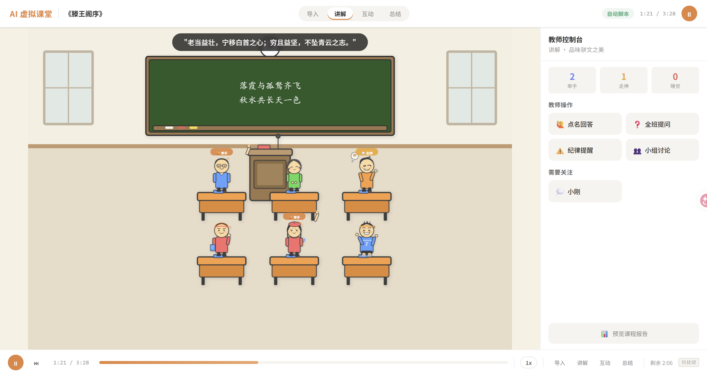
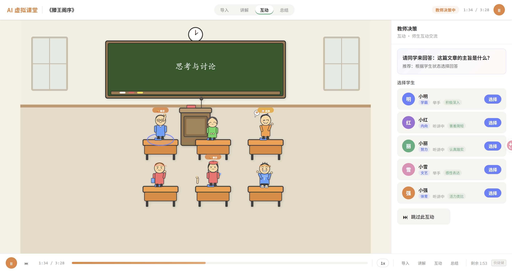
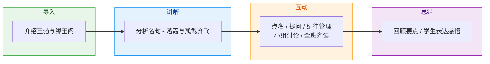
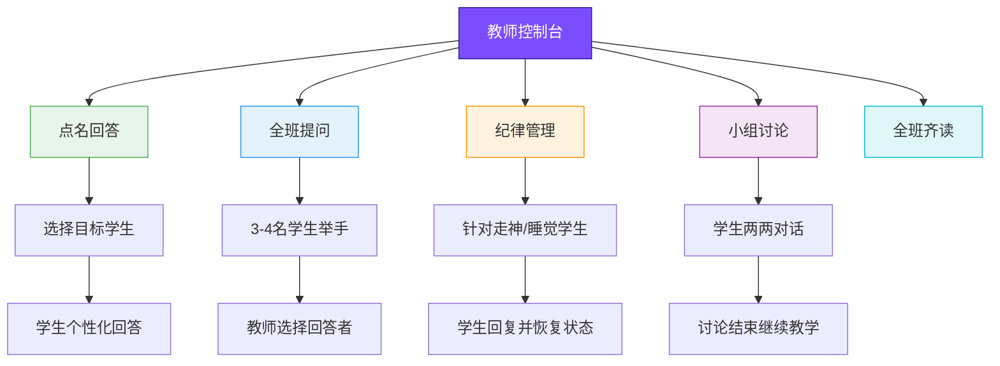
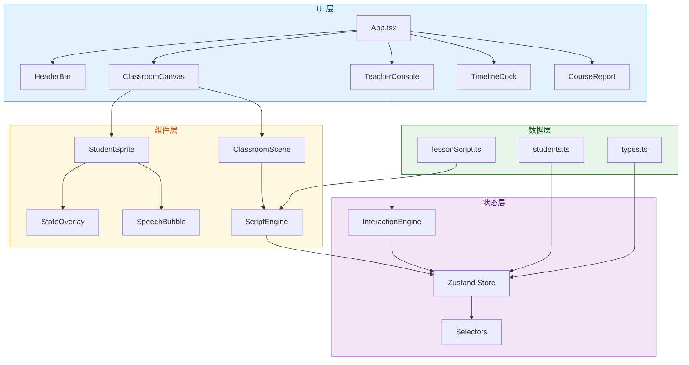
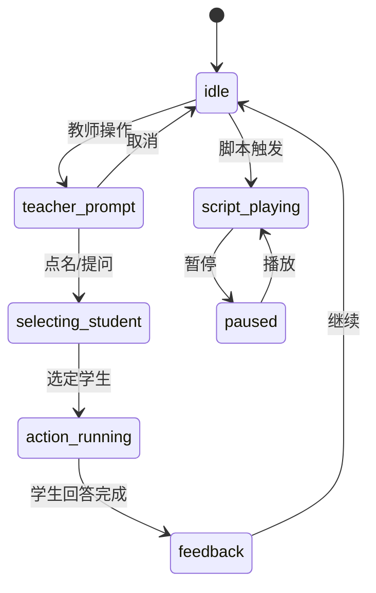
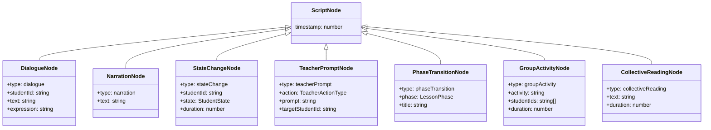

<div align="center">

# 🏫 AI 虚拟课堂

### 虚拟学生助力师范生实训

<p>
  
  
  
  
  
</p>

<p>
  基于 React + TypeScript + SVG 的产品原型演示<br/>
  展示 AI 驱动的虚拟学生在师范生教学实训中的应用场景
</p>

---

</div>

## 📸 界面预览





---

## 🎭 角色阵容

6 位 AI 虚拟学生，各自拥有 **独特的外观、性格与行为模式**：

<table>
<tr>
<td align="center" width="16%">
  <br/>
  <b>小明</b><br/>
  <sub>🎓 学霸</sub>
</td>
<td align="center" width="16%">
  <br/>
  <b>小红</b><br/>
  <sub>📚 内向</sub>
</td>
<td align="center" width="16%">
  <br/>
  <b>小刚</b><br/>
  <sub>😏 调皮</sub>
</td>
<td align="center" width="16%">
  <br/>
  <b>小丽</b><br/>
  <sub>📝 努力</sub>
</td>
<td align="center" width="16%">
  <br/>
  <b>小雪</b><br/>
  <sub>🎨 文艺</sub>
</td>
<td align="center" width="16%">
  <br/>
  <b>小强</b><br/>
  <sub>⚽ 体育</sub>
</td>
</tr>
</table>

### 性格与行为特征

| 学生 | 性格标签 | 回答风格 | 常见状态 |
|:---:|:---:|---|---|
| 🎓 小明 | **学霸** | 积极回答，分析深入，引用原文 | 主动举手、深入发言 |
| 📚 小红 | **内向** | 害羞简短，但有独到见解 | 低频举手、思考中 |
| 😏 小刚 | **调皮** | 可能偏题，容易走神，需要纪律管理 | 走神、睡觉、被点名 |
| 📝 小丽 | **努力** | 认真预习，踏实勤奋，笔记工整 | 认真听讲、高频举手 |
| 🎨 小雪 | **文艺** | 感性表达，热爱文学，富有诗意 | 沉浸朗读、主动发言 |
| ⚽ 小强 | **体育** | 充满活力，类比思维，用运动比喻 | 活力十足、偶尔走神 |

---

## 🎬 教学流程

本 demo 模拟一堂完整的中学语文课 —— **《滕王阁序》**（约 3.5 分钟）



### 各阶段详情

| 阶段 | 时长 | 黑板内容 | 关键事件 |
|:---:|:---:|---|---|
| 🟢 导入 | ~30s | 《滕王阁序》· 王勃 | 小雪主动发言分享感受 |
| 🔵 讲解 | ~60s | 落霞与孤鹜齐飞<br/>秋水共长天一色 | 小明举手回答，小刚走神 |
| 🟠 互动 | ~90s | 思考与讨论 | 点名、提问、纪律管理、小组讨论、全班齐读 |
| 🟣 总结 | ~30s | 穷且益坚<br/>不坠青云之志 | 学生表达课程感悟 |

---

## ✨ 功能特性

### 🖼️ 虚拟教室场景

```
┌─────────────────────────────────────────────────┐
│  ☁ window  ╔═══════════════════════════╗  ☁     │
│            ║    《滕王阁序》· 王勃      ║  🕐    │
│            ║                           ║        │
│            ╚═══════════════════════════╝        │
│                                                  │
│         🪑 desk    🪑 desk    🪑 desk            │
│          小明       小红       小刚              │
│                                                  │
│         🪑 desk    🪑 desk    🪑 desk            │
│          小丽       小雪       小强              │
│                                                  │
│                  🧑‍🏫 讲台                         │
└─────────────────────────────────────────────────┘
```

- SVG 手绘卡通风格渲染
- 黑板内容随教学阶段动态变化
- 窗户、时钟等环境细节

### 🎮 教师互动控制



### 🎭 学生状态系统

| 状态 | 图标 | 触发条件 | 动画效果 |
|:---:|:---:|---|---|
| 正常听讲 | 👂 | 默认 / 脚本 | 静态待机 |
| 举手 | ✋ | 教师提问 / 脚本 | 手臂举起 + 闪光粒子 |
| 回答问题 | 💬 | 被点名 | 张嘴动画 |
| 集体朗读 | 📖 | 全班齐读指令 | 书本动画 + 音符飘出 |
| 走神 | 💭 | 随机 / 脚本 | 头顶问号 + 天旋地转 |
| 睡觉 | 💤 | 随机 / 脚本 | Z 字母飘出 + 摇晃 |

每种状态配有 **独立的 CSS Keyframe 动画**，教师干预即时生效。

### 📊 课后报告

课程结束后自动生成 **数据驱动的教学评估报告**：

```
┌──────────────────────────────────────────┐
│           📊 教学评估报告                 │
├──────────────────────────────────────────┤
│                                          │
│  ┌──────┐  ┌──────┐  ┌──────┐  ┌──────┐│
│  │ 综合  │  │ 互动  │  │ 覆盖  │  │ 教学 ││
│  │ 评分  │  │ 次数  │  │ 率    │  │ 节奏 ││
│  │  87   │  │  12   │  │ 100%  │  │ 良好 ││
│  └──────┘  └──────┘  └──────┘  └──────┘│
│                                          │
│  🎯 雷达图 ── 各维度教学能力评估         │
│  📈 柱状图 ── 学生参与度对比             │
│  ⏱️ 时间轴 ── 教学阶段分布               │
│  👤 详情卡 ── 每位学生表现分析           │
│  📋 活动日志 ── 完整课堂事件时间线       │
│                                          │
└──────────────────────────────────────────┘
```

---

## 🏗️ 系统架构



### 状态管理模型



### 脚本节点类型



---

## 🛠️ 技术栈

<table>
<tr>
<td align="center" width="120"><br/><b>React 19</b></td>
<td align="center" width="120"><br/><b>TypeScript 6</b></td>
<td align="center" width="120"><br/><b>Vite 8</b></td>
<td align="center" width="120"><br/><b>Zustand 5</b></td>
<td align="center" width="120"><br/><b>CSS 动画</b></td>
<td align="center" width="120"><br/><b>SVG 图形</b></td>
</tr>
</table>

| 层级 | 技术 | 用途 |
|---|---|---|
| 框架 | React 19 + TypeScript 6 | 类型安全的组件化 UI |
| 构建 | Vite 8 | 快速 HMR 开发体验 |
| 状态 | Zustand + useSyncExternalStore | 轻量级全局状态管理 |
| 样式 | CSS Variables + Keyframe Animations | 主题化 + 学生状态动画 |
| 图形 | SVG（内联 + 外部角色资源） | 手绘卡通风格教室渲染 |
| 架构 | 纯前端，脚本预设驱动 | 零后端依赖，开箱即用 |

---

## ⌨️ 快捷键

| 按键 | 功能 |
|:---:|---|
| `Space` | 播放 / 暂停 |
| `→` | 快进到下一个互动节点 |
| `T` | 切换 2 倍速播放 |
| `5` `6` `7` `8` | 跳转到对应教学阶段 |
| 鼠标拖拽 | 进度条跳转 |

---

## 🚀 快速开始

```bash
# 克隆项目
git clone https://github.com/your-username/ai-virtual-classroom.git
cd ai-virtual-classroom

# 安装依赖
npm install

# 启动开发服务器
npm run dev

# 构建生产版本
npm run build

# 预览生产版本
npm run preview
```

---

## 📁 项目结构

```
src/
├── App.tsx                         # 主应用组件
├── main.tsx                        # 入口文件
├── vite-env.d.ts                   # Vite 类型声明
│
├── components/
│   ├── classroom/                  # 🏫 教室场景
│   │   ├── ClassroomCanvas.tsx     #   画布容器
│   │   ├── ClassroomScene.tsx      #   SVG 教室场景
│   │   ├── Blackboard.tsx          #   黑板（动态内容）
│   │   ├── Desk.tsx                #   课桌
│   │   └── Podium.tsx              #   讲台
│   │
│   ├── student/                    # 🎭 学生系统
│   │   ├── StudentSprite.tsx       #   角色精灵（SVG + 状态）
│   │   ├── StateOverlay.tsx        #   状态叠加动画
│   │   ├── SpeechBubble.tsx        #   对话气泡
│   │   ├── StudentHoverCard.tsx    #   悬浮信息卡
│   │   └── StudentStatusBadge.tsx  #   状态标签
│   │
│   ├── teacher/                    # 🧑‍🏫 教师系统
│   │   ├── TeacherConsole.tsx      #   教师控制台
│   │   ├── StudentPicker.tsx       #   学生选择器
│   │   ├── ActionResultCard.tsx    #   操作结果卡
│   │   └── ClassStatusSummary.tsx  #   班级状态概览
│   │
│   ├── report/                     # 📊 课后报告
│   │   └── CourseReport.tsx        #   数据驱动的教学评估
│   │
│   ├── layout/                     # 📐 布局组件
│   │   ├── HeaderBar.tsx           #   顶部标题栏
│   │   └── TimelineDock.tsx        #   底部时间轴
│   │
│   ├── rehearsal/                  # 🎯 排练面板
│   │   └── ReflectionPanel.tsx     #   教学反思
│   │
│   ├── NarratorOverlay.tsx         #   旁白/转场提示
│   └── ScriptEngine.tsx            #   脚本引擎（加载课程脚本）
│
├── hooks/                          # 🪝 自定义 Hooks
│   ├── useInteractionEngine.ts     #   互动状态机引擎
│   ├── useScriptPlayback.ts        #   脚本回放引擎
│   ├── useKeyboardShortcuts.ts     #   快捷键绑定
│   └── useReportData.ts            #   报告数据生成
│
├── store/                          # 📦 状态管理
│   ├── classroomStore.ts           #   Zustand 全局 Store
│   ├── selectors.ts                #   派生状态选择器
│   └── types.ts                    #   TypeScript 类型定义
│
├── data/                           # 💾 数据层
│   ├── lessonScript.ts             #   《滕王阁序》课程脚本
│   └── students.ts                 #   学生初始数据
│
├── styles/                         # 🎨 样式
│   ├── global.css                  #   全局样式 & CSS 变量
│   ├── layout.css                  #   布局样式
│   ├── animations.css              #   状态动画定义
│   ├── console.css                 #   教师控制台样式
│   └── report.css                  #   课后报告样式
│
└── assets/                         # 🖼️ 静态资源
    └── test.svg
```

---

## 💡 适用场景

<table>
<tr>
<td align="center" width="33%">

### 🎓 师范生实训

教学技能模拟练习<br/>无风险课堂试错

</td>
<td align="center" width="33%">

### 🚀 融资路演

教育科技产品原型<br/>AI + 教育方向概念验证

</td>
<td align="center" width="33%">

### 🔬 教学研究

课堂互动行为分析<br/>教学策略效果评估

</td>
</tr>
</table>

---

## 📜 License

[MIT](LICENSE) © 2024
